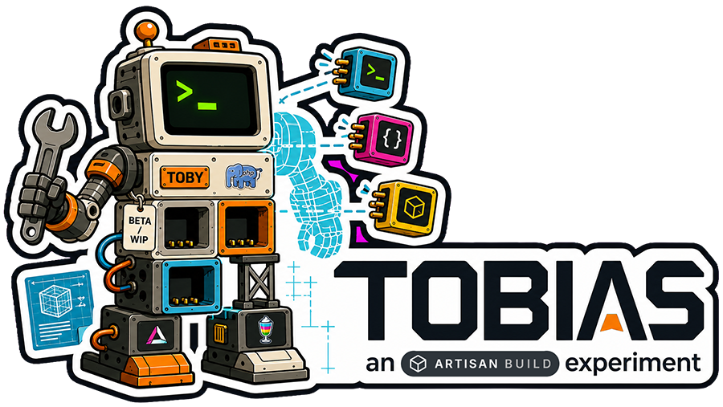
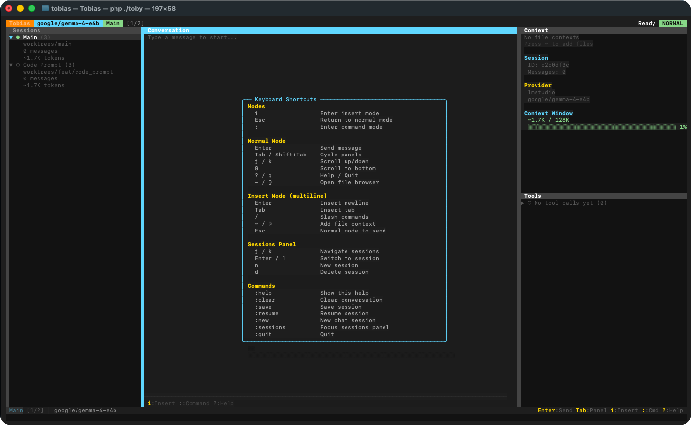

<p align="center">
  
</p>

<p align="center">
  <em>An experimental agentic coding assistant for the terminal — built in the open, on purpose unfinished.</em>
</p>

<p align="center">
  <a href="https://packagist.org/packages/artisan-build/tobias"></a>
  <a href="https://packagist.org/packages/artisan-build/tobias"></a>
  <a href="LICENSE"></a>
</p>

---

> **Heads up — this is a learning exercise, not a product.**
> Tobias (Toby to friends) is an experiment in building an agent *platform* in
> PHP. It is early, it is rough, and that's the point: it exists so we can learn
> how far Laravel, [Prism](https://github.com/prism-php/prism), and an async
> terminal UI can be pushed toward a real coding agent. How good it gets depends
> on the models *and* the architecture — and figuring out which is which is half
> the fun. Use it to tinker, not to ship.

## What it is

Tobias is a full-screen terminal UI (TUI) coding agent. It's **modal, like
vim** — you drive it from a NORMAL mode and drop into INSERT to type or a `:`
COMMAND line to run commands. It runs **multiple chat sessions in parallel**,
talks to **both hosted and locally-run models** through Prism, and can read,
write, and edit files in your project. It installs globally as the `toby`
binary.

It's built as a *platform* — the providers, tools, slash-commands, and UI
components are all pluggable pieces, with deliberate empty sockets where more
will go. Most of the interesting work is still ahead of it (see
[Roadmap](#roadmap)).

<p align="center">
  
</p>

## How it's built

| Piece            | What it does                                                                 |
| ---------------- | --------------------------------------------------------------------------- |
| **laravel-zero** | The application framework and `toby` binary.                                |
| **Prism**        | Provider orchestration — one API across hosted and local models.            |
| **Parfait**      | [`artisan-build/parfait`](https://github.com/artisan-build/parfait) — the component-based TUI rendering library. |
| **ReactPHP**     | A non-blocking event loop drives keystrokes through an `AsyncPrompt`, so the terminal never freezes while the agent thinks. |
| **Resonance**    | Optional Pusher/WebSocket layer for real-time collaboration — dormant until a channel is connected. |

The agent itself lives under `app/Console/Prompts/Code` — provider adapters,
file tools, slash-commands, and session management, each in its own small,
swappable class.

## Requirements

- PHP **8.4+** (required by `artisan-build/resonance`)
- `ext-mbstring`, `ext-intl`

## Installation

### Global

```bash
composer global require artisan-build/tobias
```

Make sure your global Composer `bin` directory is on your `PATH`
(`~/.composer/vendor/bin` or `~/.config/composer/vendor/bin`), then run `toby`.

> To track the bleeding edge instead of tagged releases, install `dev-main`
> straight from the GitHub repo:
>
> ```bash
> composer global require artisan-build/tobias:dev-main
> ```

### Local (development)

```bash
git clone https://github.com/artisan-build/tobias
cd tobias
composer install
./toby
```

## Configuration

Tobias reads provider credentials from the environment. Set keys for the
providers you use — in your shell profile for global use, or a `.env` for local
development (copy `.env.example`). You can switch providers from inside the app.

```bash
export ANTHROPIC_API_KEY=sk-ant-...
export OPENAI_API_KEY=sk-...
export GEMINI_API_KEY=...

# Local models need no key — just point at the server:
export LMSTUDIO_URL=http://127.0.0.1:1234/v1
export OLLAMA_URL=http://localhost:11434
```

Prism is configured in `config/prism.php` and recognizes a wide range of
providers (OpenAI, Anthropic, Gemini, Mistral, Groq, xAI, DeepSeek, OpenRouter,
Ollama, LM Studio, and more). The in-app provider switcher currently wires up
**Anthropic, OpenAI, Gemini, and LM Studio** — adding the rest is a matter of
dropping a small adapter into `app/Console/Prompts/Code/Providers`.

## Usage

```bash
toby            # launch the assistant (default command)
toby code       # the same thing, explicitly
toby list       # show all commands
```

### Modal editing (like vim)

Tobias has three modes. The current one shows in the status bar (`NORMAL` /
`INSERT` / `COMMAND`).

- **NORMAL** — the default. Navigate and act with single keys:
  - `i` enter INSERT · `:` enter COMMAND · `?` help · `q` quit
  - `Tab` / `Shift-Tab` move between panels · `Ctrl-P` command palette
  - `j` / `k` move the cursor, `l` select, `G` jump to bottom (panel-aware,
    vim-style) · `~` / `@` attach a file reference
  - `Enter` sends the current message
- **INSERT** — type your message. `Esc` returns to NORMAL (then `Enter` sends).
- **COMMAND** — a `:` command line. For example, `:model <name>` switches the
  active model. `Esc` cancels.

### Slash-commands

From the message line: `/help`, `/new`, `/sessions`, `/resume`, `/save`,
`/clear`, `/context`, `/quit`.

### Tools

The agent has file tools — `list_files`, `read_file`, `write_file`,
`update_file` — and a guarded `run_bash` that asks for approval before it runs
anything.

## Roadmap

Tobias is a sketch of an agent platform, not a finished one. The empty sockets
we most want to fill:

- [ ] **Migrate onto the core Laravel AI package** (still orchestrated through Prism).
- [ ] **Persist sessions in SQLite** instead of holding them only in memory.
- [ ] **Embeddings for smart auto-compaction & RAG** over long sessions and the codebase.
- [ ] **Fully async I/O** via the ReactPHP PSR-18 browser, so *nothing* — model
      calls, tools, network — ever blocks the terminal loop.
- [ ] **Stronger tools** (richer editing, search, project-aware actions).
- [ ] **A real test suite** — boot/command-registration, provider, and tool coverage.
- [ ] Maybe **session branching**. Undecided — opinions welcome.

If any of that sounds fun to hack on, that's exactly what this repo is for.

## A note on the persona

Toby thinks of itself as a PHP programmer in the Laravel ecosystem — terse,
honest about tradeoffs, and quick to say "it depends." It's built and maintained
by [Artisan Build](https://artisan.build) ([Len Woodward / ProjektGopher](https://github.com/ProjektGopher)
and Ed Grosvenor / MaybeEdward).

## License

MIT
